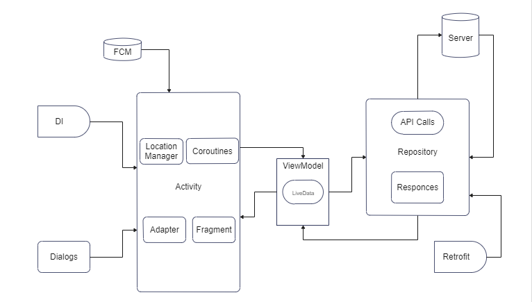
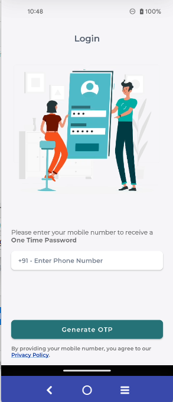
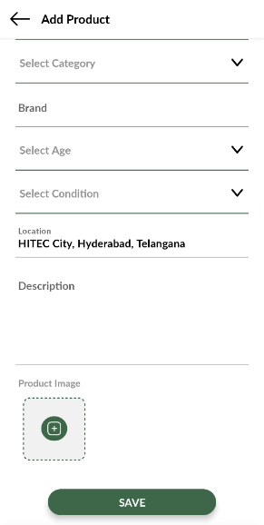

# akd-android-app
Abra Ka Dabra user android app

## AKD Android App - Dev Documentation
- Concepts
- Code Architecture
- Api's used in the app (Screen wise)

#### Developer Documentation

    - Introduction    
       
       View Binding for bind the UI elements
       Followed MVVM architecture pattern for api calls and populating the UI
       Used FCM for notification and chat functionalities
       Retrofit for API calls
       
    - Pre-requisites
        - Android Studio 3.0 or later
        - Jdk 1.8 or later
        - Postman for api testing
        - Github access
        - Firebase access
        - Play console access
        - Cloud console access
        
    - Setup Local Dev Environment
        
        - Install latest version of [Android studio](https://developer.android.com/studio?gclid=CjwKCAjwjYKjBhB5EiwAiFdSfkrUGT9BuNQduTvhHuC40tkc26Lc37sGWMIDSp6ZoVcNb4YZW8bZjxoCdf4QAvD_BwE&gclsrc=aw.ds) 
        - Set up android studio
        
    - How to build
    
        - jks file available on key forlder
        - password details available on the same folder
        
    - How to test
    
        - build an apk and install it on emulator or physical device to start testing.
    

#### Android Concepts Used in the app

    1.Kotlin programming
    2.Dagger Dependecy Injection , koin
    3.MVVM Architecture pattern
    4.View Binding
    5.Firebase Cloud Messaging
    6.Lottie 
    7.Coroutines ..
    8.Event Bus
    9.Google Ananlytics 
    10.Deep linking

#### Code Architecture

#### API's used in the app screen wise

- Login Screen

    user_login/

    device_id=4e086a0264ab14e5&lng=&sms_key=oVAKQrFfx6E&phone_number=9515958193&device_type=android&full_address=&firebase_token=cf6kiErUR5W6Zvhwi5aWGW%3AAPA91bFF52Fo5ebTXX3psxocJUFpz858e8pVNmQklfiWMHPsDeSL9n03LEt6ENi17iWULjK6RdHme78IayheXHW5tXfdQ50PaK1bn1YhGHtuPi-rcjyCQvCVtbFYEGU5rwkvAfWCAvCG&lat=

    "{
        status"": true,
        code"": 200,
        response_message"": ""Please verify your Phone number first"",
        developer_message"": ""Now, you can moved on OTP verify Screen, we have Save OTP in database and also send registered mobile number."",
        data"": null
    }"

- OTP Verification Screen

    otp_verification/

    otp=3819&phone_number=9515958193

    {
        "status": true,
        "code": 200,
        "response_message": "OTP verified successfully",
        "developer_message": "See, OTP is verify now, and update in database too, Now moved on next process.",
        "data": null
    }

- Know About You

    new_register/

    device_id=4e086a0264ab14e5&lng=78.3805537&name=Venkat&phone_number=9515958193&device_type=android&full_address=HITEC%20City%2C%20Hyderabad%2C%20Telangana&firebase_token=cf6kiErUR5W6Zvhwi5aWGW%3AAPA91bFF52Fo5ebTXX3psxocJUFpz858e8pVNmQklfiWMHPsDeSL9n03LEt6ENi17iWULjK6RdHme78IayheXHW5tXfdQ50PaK1bn1YhGHtuPi-rcjyCQvCVtbFYEGU5rwkvAfWCAvCG&email=venkat.pv71%40gmail.com&lat=17.4546478

    {
        "status": false,
        "code": 422,
        "response_message": "The email has already been taken."
    }

- Home Screen

    user_dashboard/

    page_number=1&lng=78.3805537&user_id=245&lat=17.4546478

    {
        "status": true,
        "code": 200,
        "response_message": "Home Data",
        "developer_message": "",
        "data": {
        "products": [],
        "category": [
            {
            "id": 1,    
            "category_name": "Electronics",
            "category_image": "https:\/\/abrakadabraapp.app\/app\/user_assets\/category\/electronic.png",
            "created_at": "2021-11-22 19:14:06",
            "updated_at": null
            },
            .
            .
            .
        ],  
        "notification_count": 0
        }
    }

- Add Product

    get_all_category

    {
        "status": true,
        "code": 200,
        "response_message": "All Category Data ",
        "developer_message": "",
        "data": [
        {
            "id": 1,
            "category_name": "Electronics",
            "category_image": "https:\/\/abrakadabraapp.app\/app\/user_assets\/category\/electronic.png",
            "created_at": "2021-11-22T13:44:06.000000Z",
            "updated_at": null
        },
        {
            "id": 2,
            "category_name": "Clothing",
            "category_image": "https:\/\/abrakadabraapp.app\/app\/user_assets\/category\/cloth.png",
            "created_at": "2021-11-22T13:44:06.000000Z",
            "updated_at": null
        },

        ]
    }

    product_manage/

    - get_all_notifications/
    
    page_number=1&user_id=245

    - search/
    

